# Домашнее задание 1 — аналитическая стоимость небольшой CNN

Прямой проход в FP32 последовательной сети из `models.py`, сравнение с замкнутыми формулами из `equations.py`.

## Железо и софт

| | |
|---|---|
| GPU | NVIDIA GeForce RTX 5080, 15.92 ГиБ, compute capability 12.0 |
| Драйвер | 610.88 |
| PyTorch | 2.8.0+cu128 (CUDA 12.8) |
| Python | 3.11.15 |
| Др. библиотеки | NumPy 2.4.4, SciPy 1.16.1, Matplotlib 3.10.8, nvidia-ml-py 13.595.45 |

`cudnn.benchmark` выключен, TF32 выключен: замеренные ядра — это FP32, которые выбирает эвристика cuDNN. Сеть работает в `eval()` под `torch.inference_mode()`. На вход подаются случайные тензоры.

## Как воспроизвести

Нужны Python 3.11, драйвер NVIDIA и одна GPU. Формулы в `equations.py` от карты не зависят. Латентность, энергия и θ зависят: числа в `results/` сняты на RTX 5080 с драйвером 610.88. Энергию читает счётчик NVML, пакет `nvidia-ml-py`.

Версии, на которых собраны эти результаты, лежат в `requirements.txt`. Колесо PyTorch — сборка CUDA 12.8, его нет на PyPI, индекс указан в том же файле. Окружение создаётся в этом каталоге и в git не входит.

```bash
python3.11 -m venv .venv
source .venv/bin/activate
python -m pip install -U pip
python -m pip install -r requirements.txt

python measure.py
python measure.py --oom-limit-gib 2
python measure.py --profile
python calibrate.py
python plots.py
```

`measure.py` строит сетку 11×12 (seed 0) и пишет `results/measurements.csv` и `results/hardware.json`. Флаг `--oom-limit-gib` повторяет только проход по памяти с потолком аллокатора и пишет `results/oom.csv`: на 16 ГиБ вся сетка помещается, и без потолка `OutOfMemoryError` не возникает. `--profile` пишет `results/profile.json`. `calibrate.py` подгоняет θ только по базовой сетке и пишет `results/theta.json` и часть графиков. `plots.py` добавляет панели по каждому `S`, карты отношений, производительность и карту OOM. Полный прогон `measure.py` занимает заметное время: энергия каждой точки копится не меньше 0.45 с.

Базовая сетка: сторона 32, 64, 128, 224, 256, 384, 512 и батч 1, 2, 4, 8, 16, 32, 64, 128, 256. В проверку отложены стороны 176, 288, 336, 400 и батчи 9, 50, 209. Точка проверочная, если в этом наборе её сторона или её батч (69 точек). Остальные 63 точки обучают подгонку.

Сеть в `models.py` — это таблица из задания: после каждой свёртки сразу ReLU, без BatchNorm. Параметров 1 040 324. Вариант Conv → BN → ReLU дал бы другие формулы (у BN ещё affine-коэффициенты и running-статистики).

Латентность — медиана wall-clock одного синхронизированного прохода. Энергия — счётчик NVML по всему GPU за серию не короче 0.45 с, делённый на число проходов. Пик памяти — `torch.cuda.max_memory_allocated()` вокруг одного прохода; в него входят параметры и вход.

## Подгонка

Неотрицательный метод наименьших квадратов, веса `1/y`, столбцы `(1, FLOPs, переданные байты)`.

| | постоянный член | на FLOP | на байт | медиана train | медиана val | MAPE val | максимум val |
|---|---|---|---|---|---|---|---|
| Латентность | 0.282 мс | 0 | 5.81×10⁻¹² с/байт (172 ГБ/с) | 11.9% | 16.6% | 16.4% | 65.7% |
| Энергия | 0.0130 Дж | 0 | 1.93×10⁻⁹ Дж/байт | 14.3% | 14.5% | 15.7% | 44.3% |
| Память | — | — | — | 40.4% | 31.4% | 35.0% | 66.5% |

Ошибки на обучении и на проверке одного порядка: латентность 18.3% и 16.4% MAPE. Модель не запоминает базовую сетку.

У памяти свободных параметров нет. Медиана отношения измеренного пика к предсказанному — 1.53 (максимум 3.26).

Два наклона по отдельности не наблюдаются. На этой сетке корреляция Пирсона между FLOPs и байтами равна 1.000: оба растут как `B S²`, и корреляцию определяют самые большие точки. Когда `B S²` велико, байты ≈ (196/17714) FLOPs, то есть около 90 FLOP/байт. Неотрицательный МНК кладёт весь наклон в столбец байтов и обнуляет коэффициент при FLOPs. Отношение двух подогнанных коэффициентов при байтах даёт согласованную мощность: энергия на байт / время на байт ≈ 332 Вт, рядом с паспортными 360 Вт платы. Отношение постоянных членов 0.0130 Дж / 0.282 мс ≈ 46 Вт — это карта в простое между короткими запусками.

## Где модель держится

На больших картах проход достаточно длинный, и постоянная цена запуска уже не видна. При `S=512` измеренные точки, включая проверочные батчи, лежат на предсказанной кривой от `B=1` (около 0.5 мс) до `B=256` (71 мс). Достигнутая производительность на малых работах почти нулевая, затем выходит на плато около 13–17 TFLOP/s; асимптота подгонки — 15.6 TFLOP/s. Это 140–186 ГБ/с. Мощность всего GPU на этих точках около 300–360 Вт, поэтому джоули повторяют секунды. На карте отношений большие `S` близки к единице и по латентности, и по энергии; красный угол — маленькие `S`, где замер в разы выше формулы.

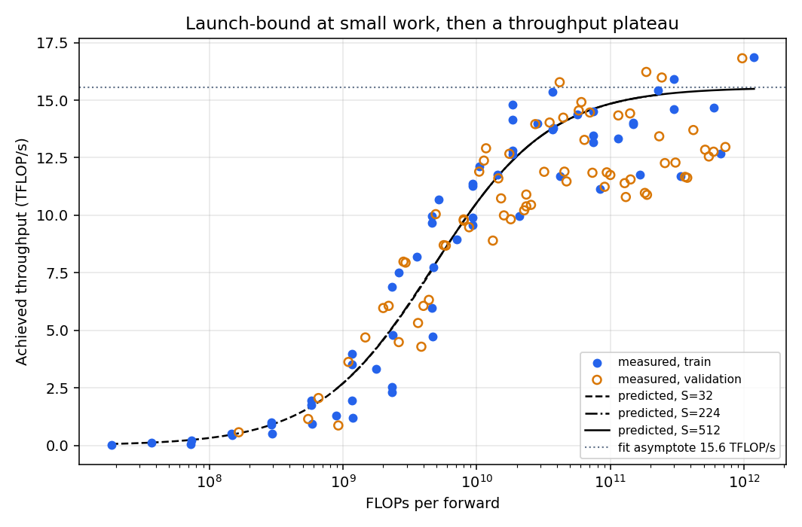

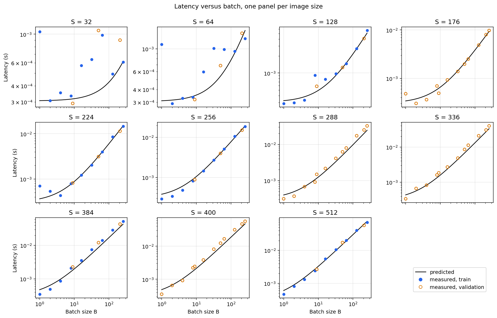

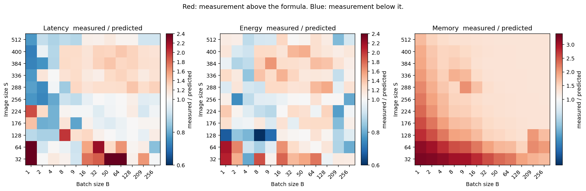

## Где модель ломается

**Сначала запуск, потом один наклон — три чистых режима не выделяются.** Постоянный член около 0.28 мс. Он главный при `S=32` на всём диапазоне батчей и ещё заметен при `S=224`, пока батч не дойдёт до нескольких десятков. Дальше берёт верх член с байтами (`latency_regimes.png`). Вычислительный член подгонку нигде не выигрывает. Паспортный руфлайн этой GPU (56.3 TFLOP/s FP32, 960 ГБ/с) имеет гребень около 59 FLOP/байт, а асимптота интенсивности сети — около 90 FLOP/байт, так что самые крупные формы были бы слегка compute-bound, если бы ядра шли на пике. Они туда не выходят: 17 TFLOP/s — это около 30% пика FP32, 186 ГБ/с — около 19% пика GDDR7. Eager-свёртки cuDNN в FP32 не достают ни до одной крыши, а коллинеарные признаки не дают подгонке предпочесть FLOPs байтам. Измерения реально разделяют только переход launch-bound → traffic-bound.

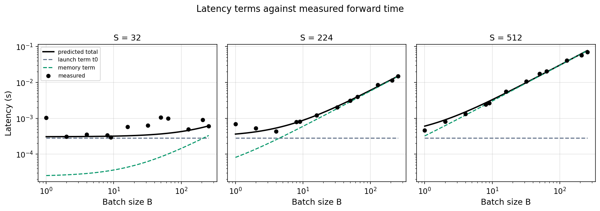

**Пол запуска шумный.** На 38 точках, где `t0` — старший член, медианная абсолютная ошибка 23%. Один eager-проход не удерживает частоты 5080: измеренная мощность на этих точках гуляет примерно от 40 до 140 Вт, а wall-clock при `S=32` прыгает примерно от 0.3 до 1 мс. Одной константой разгон частот не описать. Это веер точек слева на графике «предсказание против замера» и разброс вокруг плоского предсказания на панели `S=32`.

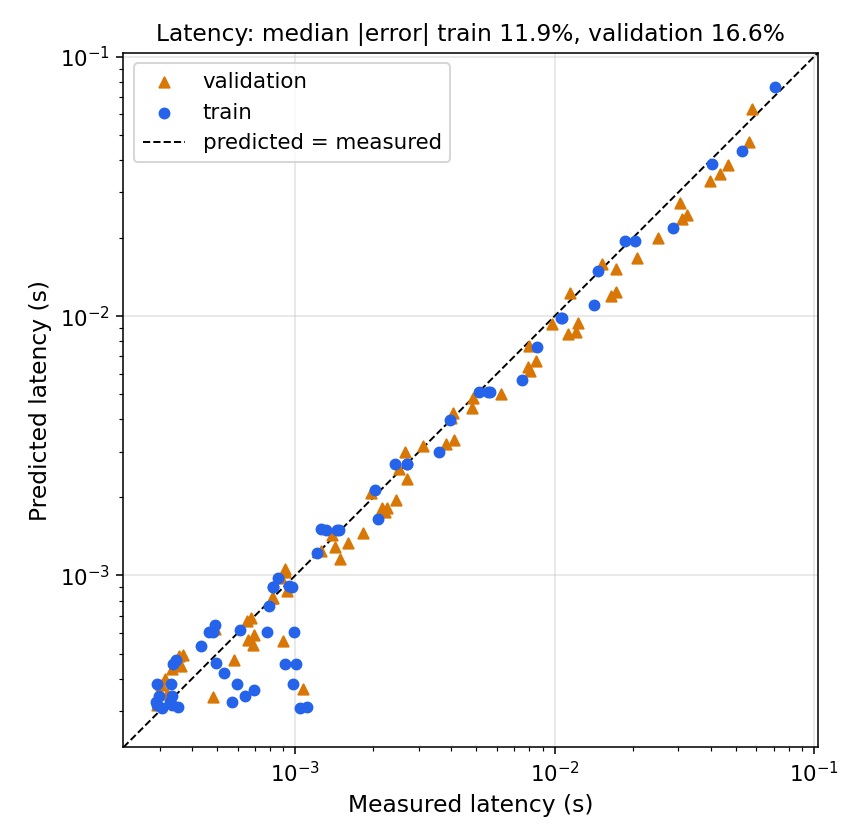

**Проверка хуже по конкретной причине.** Медианная ошибка латентности растёт с 11.9% на базовой сетке до 16.6% на отложенных формах. Знаковая ошибка на батчах-степенях двойки около +5%, на остальных (включая 9, 50 и 209) около +12%. Формула строго линейна по `B`. cuDNN — нет: нечётные размеры чуть менее эффективны, и модель их недооценивает.

**Память — нижняя оценка, и из-за этого формула опаздывает с OOM.** Формула считает параметры плюс три тензора, которые одновременно живы на MaxPool (вход держит вызывающий код; inplace ReLU ничего не выделяет; inference mode не хранит состояние autograd). Workspace cuDNN и округление аллокатора в неё не входят. Измеренный пик выше везде: при `S=32`, `B=1` зазор около 9 МиБ (13 МиБ против 4.0 МиБ, отношение 3.26), при `S=512`, `B=256` около 1.0 ГиБ (4.26 ГиБ против 3.25 ГиБ, отношение 1.31). Отношение падает, абсолютный зазор растёт: пропущенный буфер масштабируется со свёрткой и медленнее активаций. На полной карте OOM нет. С потолком аллокатора 2 ГиБ (`results/oom.csv`) из 132 точек не влезли 6. Формула заранее называет OOM только две из них, `S=512` при `B=209` и `B=256`. Ещё четыре она считает влезающими, а прогон падает: `S=512, B=128`, `S=384, B=256`, `S=400, B=209`, `S=400, B=256`. Для `S=512, B=128` формула даёт 1.63 ГиБ, без потолка замер был 2.14 ГиБ. Обратных ошибок нет: ни одна точка, которую формула считает слишком большой, под потолком не поместилась.

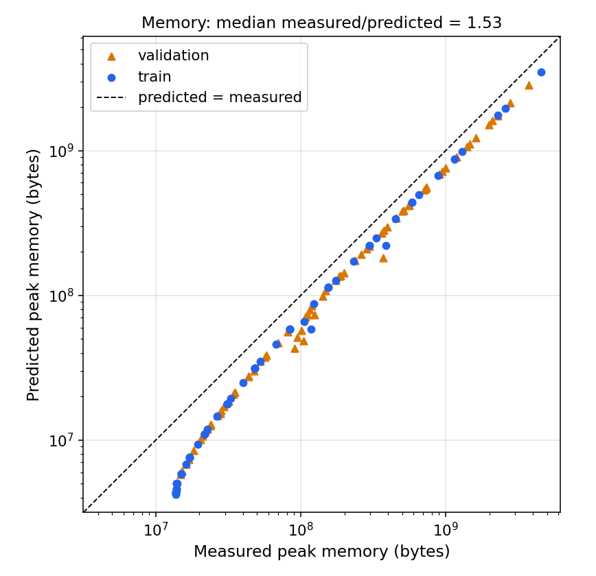

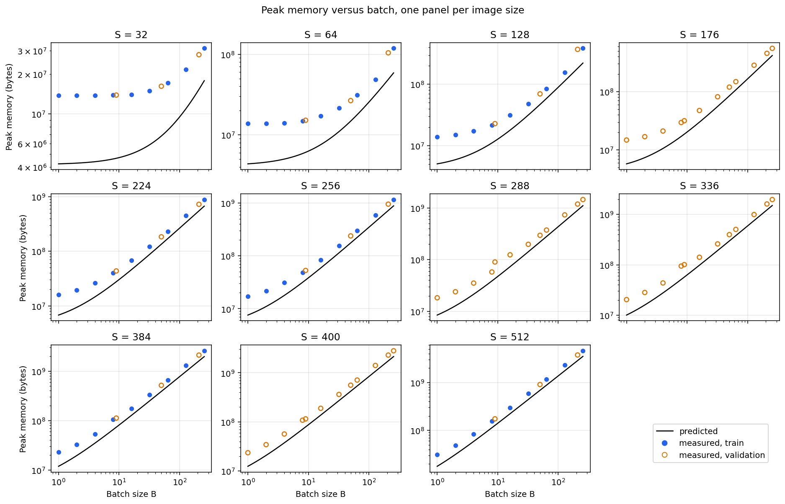

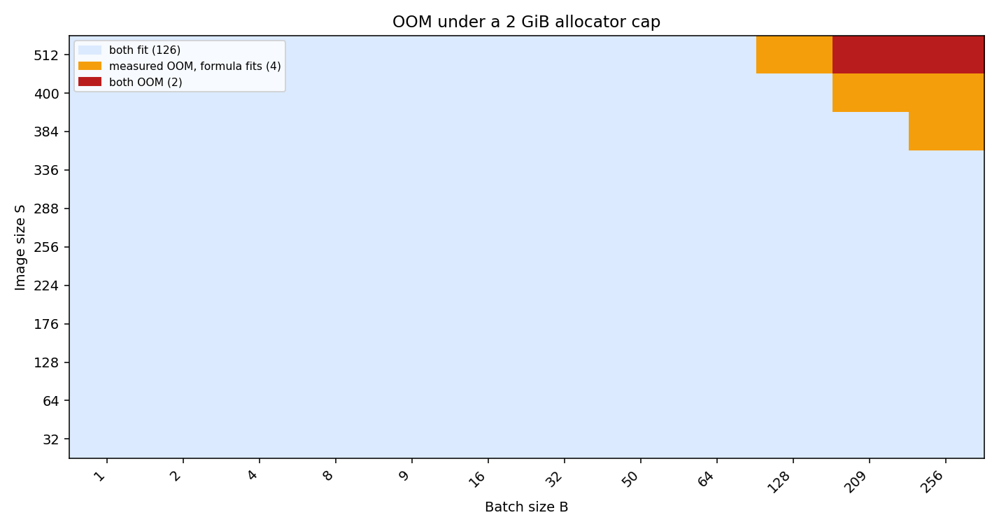

Профайлер на `S=512, B=64` и `B=128` показывает одни и те же implicit-GEMM ядра, без FFT. Время 20.3 мс и 40.2 мс, память в полном прогоне 1100 МиБ и 2188 МиБ: и то и другое растёт вместе с батчем. Скачка алгоритма, при котором `B=64` был бы медленнее и прожорливее `B=128`, на этой карте нет. Под потолком 2 ГиБ удачные конфигурации занимают столько же, сколько без него: cuDNN не ужимал буфер, а на слишком больших формах просто отказывался.

**Запусков ядер меньше, чем если считать каждый слой отдельным.** После прогрева при `S=32, B=1` wall-clock 0.34 мс, интервал CUDA-событий 0.30 мс: почти всё время уже на стороне GPU, отдельная CPU-надбавка около 0.04 мс. Профайлер пишет 13 записей, среди них `cudnn_convolution` (implicit GEMM), `clamp_min_` для ReLU, max-pool и `addmm` для линейных слоёв. BatchNorm в трассе нет. На `S=224` и `S=512` записей 16. Постоянный член 0.28 мс — это цена этой короткой цепочки, а не 25 отдельных запусков. На холодной сетке те же маленькие формы растягиваются до ~1 мс, когда частоты карты падают; после прогрева пол ниже.

**Энергия повторяет время, а на коротких проходах шумит.** Ниже примерно 1 мс интеграл NVML по нескольким сотням миллисекунд запусков дрожит — это левый край графика энергии. Когда проход длинный, мощность почти постоянная и высокая, и ошибка энергии совпадает с ошибкой латентности (медиана на проверке 14.5%, по сути как на обучении). Замер по всему GPU не отделяет энергию SM от энергии памяти; при нулевом коэффициенте FLOP обе подогнанные модели — это постоянный член плюс член, пропорциональный байтам.

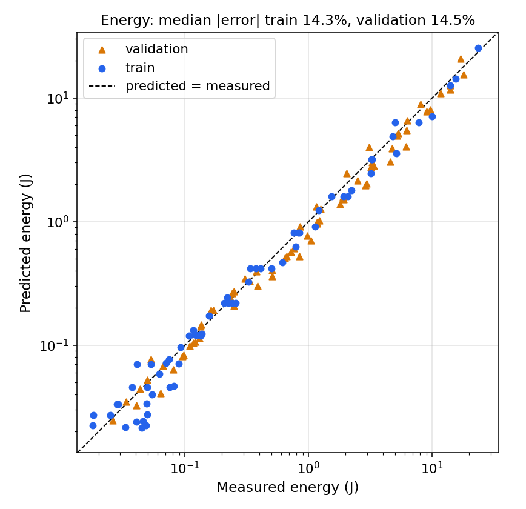

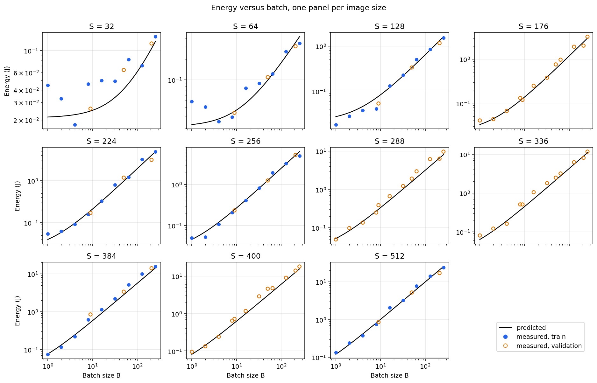

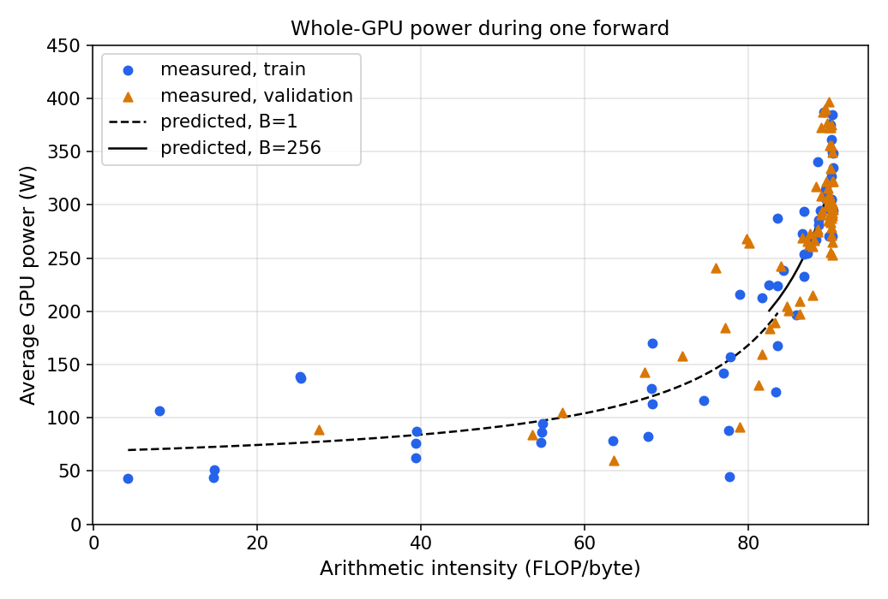
